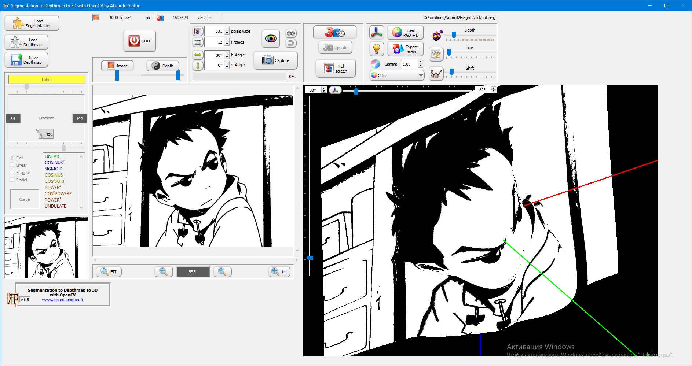

# Normal2Height2

Converting a Normal Map to a Height (Displacement) Map

An accompany to https://github.com/V-Sense/DeepNormals.

Please note also https://github.com/Chaosinism/NormalMapTool.

Can be used together with https://github.com/aliakseis/line-filler and https://github.com/aliakseis/DeepNormals-tflite.

Demo using https://github.com/aliakseis/segmentation-depthmap-3d-opencv:

